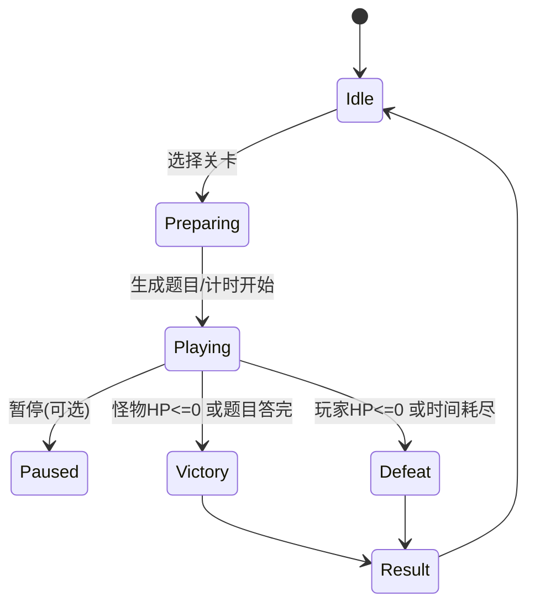

# # 口算闯关小游戏 · 技术设计文档

## 1. 目标与原则

* **纯前端**：单页应用（SPA），静态部署即可运行（本地 `file://` 也可）。
* **数据本地化**：玩家档案、积分、关卡记录都存 `localStorage`。
* **可扩展**：新关卡通过**模板 JSON**配置，题目由“出题器”随机生成，避免重复。
* **有趣耐玩**：打怪机制 + 动画 + 计时 + 评分 + 成就徽章。

---

## 2. 核心玩法（Game Loop）

1. 进入某一关（如“6 以内乘法口诀”），系统按模板生成一套题（默认 30 题，可配置）。
2. 倒计时开始；答题采用**秒答输入**：

   * 每题：显示题干（含空缺符号 “？” 时用输入框补空）。
   * 玩家提交答案：

     * **正确**：植物向僵尸发射子弹，怪物扣血。
     * **错误**：僵尸丢石头砸植物，玩家扣血。
3. 怪物血量与玩家血量由关卡模板设定（或由题目数与难度自动计算）。
4. 倒计时结束或一方 HP 归零，结算胜负与评分。
5. 成绩写入本地档案：关卡最高分、最快时间、正确率、连击纪录、总积分累计等。

---

## 3. 页面与路由（单页）

* **/home**：主页（开始游戏、继续、成就/统计、设置）
* **/levels**：关卡选择（分“模板大类分组”+ 搜索过滤 + 关卡进度显示）
* **/play?levelId=xxx**：游戏页（题目、计时、HP、动画）
* **/result**：结算页（得分、用时、正确率、明细、再来一局）
* **/stats**：统计页（各关成绩、总积分曲线、徽章）
* **/settings**：设置（音效、配色、字号、出题偏好）

> 路由用 `location.hash`（HashRouter）实现，避免后端支持。

---

## 4. 技术栈与结构

* **原生** HTML + CSS + JS（ES6+），无需框架。文件：

  * `index.html`：单文件入口（也可拆 `app.css/app.js`）
  * 逻辑模块（可内联或拆分）：

    * `store.js`：localStorage 数据层
    * `levels.js`：关卡模板与出题器注册表
    * `engine.js`：游戏引擎（状态机、计时、伤害计算）
    * `ui.js`：视图渲染与动画
    * `audio.js`（可选）：音效管理
* **样式**：CSS 变量 + 简单 BEM；动画用 `@keyframes`。
* **音效**：`<audio>` + 轻量资源（可选开关）。

---

## 5. 数据存储（localStorage）

### 5.1 Key 命名

* `mentalGame:v1:profile`：玩家档案（昵称、创建时间、设置）
* `mentalGame:v1:progress`：关卡进度（数组/Map）
* `mentalGame:v1:stats`：总体统计（总积分、总时长、总题数等）
* `mentalGame:v1:achievements`：成就徽章
* `mentalGame:v1:settings`：UI/音效/字号/色盲辅助等

> **版本化**：将来变更结构时，通过 `migrations` 做兼容。

### 5.2 数据结构示例

```json
// progress（示例）
[
  {
    "levelId": "add_1_5",
    "bestScore": 980,
    "bestTimeSec": 42,
    "bestAccuracy": 1.0,
    "playCount": 5,
    "lastPlayedAt": 1733347200000
  }
]
```

---

## 6. 关卡模板与出题器

### 6.1 模板总览

* 每一关由模板定义 **题型范围**、**题量**、**时间**、**HP**、**每题伤害**、**得分规则** 等。
* **题目随机**：用统一的“出题器”函数，传入模板参数生成题；保证**集合内不重复**（必要时扩域/洗牌）。
* **题目结构**统一：

```ts
type Question = {
  id: string;        // 唯一
  text: string;      // 用于展示的题干，如 "6 + 3 = ?"
  kind: "normal" | "fill" | "compare" | "remainder";
  answer: string;    // 标准答案(字符串)
  meta?: object;     // 辅助信息（如 operands, ops, unitType 等）
};
```

### 6.2 评分与战斗参数

* **默认**（可被模板覆盖）：

  * 题量：30（早期低年级题可以 20）
  * 倒计时：120 秒（困难提升或降低）
  * 玩家 HP：100，怪物 HP：100
  * **正确伤害**：`怪物HP -= floor(100 / 题量)`（保证全对刚好击杀）
  * **错误伤害**：`玩家HP -= floor(100 / (题量/2))`（连续错会更紧张）
  * **评分**：`score = 正确数*10 + 连续正确奖励 + 时间奖励 + 难度系数`

    * 连续正确奖励：`combo^2` 累加（上限可设）
    * 时间奖励：`max(0, ceil((剩余秒 / 总秒) * 200))`
    * 难度系数：模板可设，如 `1.0 ~ 2.0`
  * **总积分**：累加 `score`，用于解锁/排行/徽章。

---

## 7. 出题器类型（Generators）

> 下面列出常用出题类型，所有下文关卡都由它们组合，**开发只需实现这些出题器**即可：

1. **加减法（定范围）**：`genAddSub(rangeMax, allowNegative=false, ops=["+","-"])`
2. **加减混合（多项式，括号可选）**：`genAddSubChain(terms, rangePerTerm, withParen=false)`
3. **乘法口诀/表内除法**：`genMulDiv(tableMax=9, mode="mul"|"div"|"mix", tableLimit=6|9)`
4. **不进位加/不退位减**：`genNoCarryAdd(rangeMax)` / `genNoBorrowSub(rangeMax)`
5. **凑十/填空**：`genMake10(mode="add"|"fill")`、`genFillBlank(templateType, params)`
6. **整十/整百/整千的加减**：`genTensHundredsThousands(kind, withCarry=true|false)`
7. **两位数与一位/整十数混合**：`genTwoDigitPlusMinus(kind)`
8. **单位换算**：`genUnitConv(type="currency"|"length"|"time")`
9. **大小比较**：`genCompare(type="time"|...)`，输出 `a ? b`，答案为 `>`/`<`/`=`
10. **有余数的除法**：`genDivRemainder(rangeDividend, divisorRange)`
11. **三数连加/连减/混合**：`genChain3(range, opsPattern)`
12. **含小括号的混合运算**：`genParenExpr(patterns)`
13. **两位数加两位数（和≤100）**：`genTwoPlusTwo(limit=100)`

> **唯一性**：生成时维护集合 `seen`（按题干文本或结构序列化），不重复再入集；否则继续随机直到满额或放宽条件。

---

## 8. 全量初始关卡模板（覆盖你列出的全部）

> 字段：`id`，`name`，`desc`，`generator`（类型与参数），`count`，`timeSec`，`difficulty`（系数），`hp`（可省略，默认 100/100）
> ✅ 已按你给的 1~39 + 后续扩展项逐一映射。

```js
const LEVELS = [
  // 1~7（5内与10内基础）
  {id:"add_1_5",name:"5以内的加法",desc:"例：2+3=?",generator:{type:"addsub",ops:["+"],max:5},count:20,timeSec:60,difficulty:1.0},
  {id:"sub_1_5",name:"5以内的减法",desc:"例：4-2=?",generator:{type:"addsub",ops:["-"],max:5},count:20,timeSec:60,difficulty:1.0},
  {id:"addsub_1_5",name:"5以内的加减法",desc:"加减混合",generator:{type:"addsub",ops:["+","-"],max:5},count:20,timeSec:60,difficulty:1.1},
  {id:"add_1_10",name:"10以内的加法",desc:"例：6+3=?",generator:{type:"addsub",ops:["+"],max:10},count:25,timeSec:80,difficulty:1.1},
  {id:"sub_1_10",name:"10以内的减法",desc:"例：6-3=?",generator:{type:"addsub",ops:["-"],max:10},count:25,timeSec:80,difficulty:1.1},
  {id:"addsub_1_10",name:"10以内的加减法",desc:"加减混合",generator:{type:"addsub",ops:["+","-"],max:10},count:25,timeSec:80,difficulty:1.2},
  {id:"fill_1_10",name:"10以内的填括号",desc:"例：4-？=1",generator:{type:"fill",mode:"within10"},count:20,timeSec:80,difficulty:1.2},

  // 8~16（20内与凑10）
  {id:"add_no_carry_20",name:"20以内不进位加法",desc:"例：16+3=?",generator:{type:"noCarryAdd",max:20},count:25,timeSec:90,difficulty:1.2},
  {id:"sub_no_borrow_20",name:"20以内不退位减法",desc:"例：16-3=?",generator:{type:"noBorrowSub",max:20},count:25,timeSec:90,difficulty:1.2},
  {id:"make10",name:"凑10练习",desc:"例：？+8=10",generator:{type:"make10"},count:20,timeSec:60,difficulty:1.1},
  {id:"add_carry_20",name:"20以内进位加法",desc:"例：8+8=?",generator:{type:"carryAdd",max:20},count:25,timeSec:90,difficulty:1.3},
  {id:"sub_borrow_20",name:"20以内退位减法",desc:"例：15-7=?",generator:{type:"borrowSub",max:20},count:25,timeSec:90,difficulty:1.3},
  {id:"add_20",name:"20以内的加法",desc:"例：15+3=?",generator:{type:"addsub",ops:["+"],max:20},count:25,timeSec:90,difficulty:1.2},
  {id:"sub_20",name:"20以内的减法",desc:"例：15-3=?",generator:{type:"addsub",ops:["-"],max:20},count:25,timeSec:90,difficulty:1.2},
  {id:"addsub_20",name:"20以内的加减法",desc:"混合",generator:{type:"addsub",ops:["+","-"],max:20},count:25,timeSec:90,difficulty:1.3},
  {id:"fill_1_20",name:"20以内的填括号",desc:"例：10+？=13",generator:{type:"fill",mode:"within20"},count:20,timeSec:90,difficulty:1.3},

  // 17~26（整十/综合）
  {id:"tens_plus_one",name:"整十数+一位数",desc:"例：50+3=?",generator:{type:"tensOp",op:"+",mode:"tens+one"},count:20,timeSec:80,difficulty:1.2},
  {id:"mix_1",name:"第一册计算综合",desc:"例：20-19+17",generator:{type:"chain",terms:3,max:20},count:25,timeSec:120,difficulty:1.4},
  {id:"tens_minus_one",name:"整十数-一位数",desc:"例：80-5=?",generator:{type:"tensOp",op:"-",mode:"tens-one"},count:20,timeSec:80,difficulty:1.2},
  {id:"tens_plus_tens",name:"整十数+整十数",desc:"例：80+10=?",generator:{type:"tensOp",op:"+",mode:"tens+tens"},count:20,timeSec:80,difficulty:1.2},
  {id:"tens_minus_tens",name:"整十数-整十数",desc:"例：80-10=?",generator:{type:"tensOp",op:"-",mode:"tens-tens"},count:20,timeSec:80,difficulty:1.2},
  {id:"two_plus_one",name:"两位数+一位数",desc:"例：37+7=?",generator:{type:"twoPlusOne"},count:25,timeSec:100,difficulty:1.3},
  {id:"two_plus_tens",name:"两位数+整十数",desc:"例：37+40=?",generator:{type:"twoPlusTens"},count:25,timeSec:100,difficulty:1.3},
  {id:"two_minus_one",name:"两位数-一位数",desc:"例：37-4=?",generator:{type:"twoMinusOne"},count:25,timeSec:100,difficulty:1.3},
  {id:"two_minus_tens",name:"两位数-整十数",desc:"例：37-20=?",generator:{type:"twoMinusTens"},count:25,timeSec:100,difficulty:1.3},
  {id:"mix_2",name:"第二册计算综合",desc:"例：39-21,20+26",generator:{type:"chain",terms:2..3,max:40},count:25,timeSec:120,difficulty:1.5},

  // 27~39（100 内、连加连减、混合）
  {id:"fill_1_100",name:"100以内的填括号",desc:"例：19+？=31",generator:{type:"fill",mode:"within100"},count:20,timeSec:120,difficulty:1.4},
  {id:"chain_add_10",name:"10以内三个数连加",desc:"例：2+1+5",generator:{type:"chain3",max:10,ops:"+ +"},count:20,timeSec:80,difficulty:1.2},
  {id:"chain_sub_10",name:"10以内三个数连减",desc:"例：5-2-1",generator:{type:"chain3",max:10,ops:"- -"},count:20,timeSec:80,difficulty:1.3},
  {id:"chain_mix_10",name:"10以内三数加减混合",desc:"加+减",generator:{type:"chain3",max:10,ops:"+ -| - +"},count:20,timeSec:90,difficulty:1.35},
  {id:"mix_10",name:"10以内的加减混合",desc:"例：5-0+1",generator:{type:"addsubChain",terms:3,max:10},count:20,timeSec:90,difficulty:1.3},
  {id:"chain_add_20",name:"20以内三个数的加法",desc:"例：12+1+5",generator:{type:"chain3",max:20,ops:"+ +"},count:20,timeSec:90,difficulty:1.35},
  {id:"chain_sub_20",name:"20以内三个数的减法",desc:"例：15-4-7",generator:{type:"chain3",max:20,ops:"- -"},count:20,timeSec:90,difficulty:1.45},
  {id:"chain_mix_20",name:"20以内三数加减混合",desc:"混合",generator:{type:"chain3",max:20,ops:"+ -| - +"},count:20,timeSec:100,difficulty:1.5},
  {id:"mix_20",name:"20以内加减混合",desc:"例：19-3+0",generator:{type:"addsubChain",terms:3,max:20},count:20,timeSec:100,difficulty:1.45},
  {id:"unit_currency",name:"元角分换算",desc:"例：6角9分 = ?分",generator:{type:"unitConv",subtype:"currency"},count:20,timeSec:120,difficulty:1.6},
  {id:"sum_le_100",name:"和在100以内的连加",desc:"例：7+67+18",generator:{type:"multiAddLimit",limit:100},count:20,timeSec:110,difficulty:1.5},
  {id:"sub_le_100",name:"被减数在100以内的连减",desc:"例：76-49-11",generator:{type:"multiSubLimit",limit:100},count:20,timeSec:110,difficulty:1.6},
  {id:"mix_addsub_100",name:"100以内连加连减混合",desc:"加减混合",generator:{type:"addsubChain",terms:3,max:100},count:20,timeSec:120,difficulty:1.7},

  // —— 扩展：两位数加两位数/更高位与乘除 —— 
  {id:"two_plus_two_100",name:"两位数+两位数（和≤100）",desc:"例：32+44",generator:{type:"twoPlusTwoLimit",limit:100},count:25,timeSec:120,difficulty:1.6},
  {id:"two_minus_two",name:"两位数-两位数",desc:"例：65-17",generator:{type:"twoMinusTwo"},count:25,timeSec:120,difficulty:1.7},
  {id:"tens_minus_two",name:"整十数-两位数",desc:"例：70-24",generator:{type:"tensMinusTwo"},count:25,timeSec:110,difficulty:1.6},
  {id:"two_add_sub",name:"两位数加减法",desc:"例：32+44/65-17",generator:{type:"addsubTwoDigits"},count:25,timeSec:120,difficulty:1.7},

  {id:"mul_6",name:"6以内的乘法口诀",desc:"2~6 乘法表",generator:{type:"mulTable",maxTable:6},count:30,timeSec:120,difficulty:1.6},
  {id:"mul_9",name:"9以内的乘法口诀",desc:"2~9 乘法表",generator:{type:"mulTable",maxTable:9},count:30,timeSec:140,difficulty:1.8},
  {id:"div_6",name:"6以内的表内除法",desc:"除法表",generator:{type:"divTable",maxTable:6},count:30,timeSec:140,difficulty:1.8},
  {id:"div_9",name:"9以内的表内除法",desc:"除法表",generator:{type:"divTable",maxTable:9},count:30,timeSec:150,difficulty:2.0},
  {id:"muldiv_6",name:"6以内表内乘除混合",desc:"乘/除",generator:{type:"mulDivMix",maxTable:6},count:30,timeSec:150,difficulty:2.0},
  {id:"muldiv_9",name:"9以内表内乘除混合",desc:"乘/除",generator:{type:"mulDivMix",maxTable:9},count:30,timeSec:160,difficulty:2.2},

  {id:"k_1000_add",name:"整千数加法（和<10000）",desc:"4000+2000",generator:{type:"thousandsAdd",limit:10000},count:20,timeSec:120,difficulty:1.8},
  {id:"k_1000_sub",name:"整千数减法",desc:"4000-2000",generator:{type:"thousandsSub"},count:20,timeSec:120,difficulty:1.8},
  {id:"k_1000_mix",name:"整千加减（和<10000）",desc:"加/减",generator:{type:"thousandsMix",limit:10000},count:20,timeSec:130,difficulty:1.9},

  {id:"tens_carry",name:"整十+整十（进位）",desc:"80+60",generator:{type:"tensCarryAdd"},count:20,timeSec:90,difficulty:1.6},
  {id:"tens_borrow",name:"整十-整十（退位）",desc:"130-60",generator:{type:"tensBorrowSub"},count:20,timeSec:90,difficulty:1.6},
  {id:"tens_mix_over100",name:"整十加减（和>100/退位）",desc:"120-40 / 20+80",generator:{type:"tensMixOver100"},count:20,timeSec:100,difficulty:1.7},

  {id:"hundreds_carry",name:"整百+整百（进位）",desc:"800+600",generator:{type:"hundredsCarryAdd"},count:20,timeSec:100,difficulty:1.8},
  {id:"hundreds_borrow",name:"整百-整百（退位）",desc:"1300-600",generator:{type:"hundredsBorrowSub"},count:20,timeSec:100,difficulty:1.9},
  {id:"hundreds_mix_over1000",name:"整百加减（和>1000/退位）",desc:"1500-1300",generator:{type:"hundredsMixOver1000"},count:20,timeSec:110,difficulty:2.0},

  {id:"tri_end0_add",name:"尾数0三位数加法（和<1000）",desc:"180+710",generator:{type:"end0ThreeAdd",limit:1000},count:20,timeSec:110,difficulty:1.9},
  {id:"tri_end0_sub",name:"尾数0三位数减法（退位）",desc:"820-520",generator:{type:"end0ThreeSub"},count:20,timeSec:110,difficulty:2.0},
  {id:"tri_end0_mix",name:"尾数0三位数加减法",desc:"210+390 / 200-180",generator:{type:"end0ThreeMix"},count:20,timeSec:120,difficulty:2.0},

  {id:"mul_add_mix",name:"表内乘加混合",desc:"4×7+3",generator:{type:"mulAddMix"},count:25,timeSec:130,difficulty:2.1},
  {id:"same_int_add_10",name:"10以内相同整数连加",desc:"6+6+6+6",generator:{type:"sameAdd",max:10},count:25,timeSec:110,difficulty:1.7},
  {id:"div_add_mix",name:"10以内除法+加法混合",desc:"48÷6+3",generator:{type:"divAddMix",max:10},count:25,timeSec:130,difficulty:2.0},
  {id:"multi_mul_10",name:"10以内整数连乘",desc:"3×2×7",generator:{type:"multiMul10"},count:25,timeSec:130,difficulty:2.1},
  {id:"multi_div_10",name:"10以内整数连除",desc:"54÷9÷1",generator:{type:"multiDiv10"},count:25,timeSec:130,difficulty:2.1},
  {id:"mul_div_mix10",name:"10以内乘除混合",desc:"10÷5×8",generator:{type:"mulDivMixExpr"},count:25,timeSec:140,difficulty:2.2},

  {id:"unit_length",name:"长度单位（米↔厘米）",desc:"3米=?厘米",generator:{type:"unitConv",subtype:"length"},count:20,timeSec:120,difficulty:1.6},
  {id:"unit_time",name:"时间单位换算",desc:"1分19秒=?秒",generator:{type:"unitConv",subtype:"time"},count:20,timeSec:130,difficulty:1.7},
  {id:"time_compare",name:"时间大小比较",desc:"50秒 ? 4分",generator:{type:"compare",subtype:"time"},count:20,timeSec:110,difficulty:1.7},
  {id:"div_remainder",name:"有余数的除法",desc:"11÷6=?余?",generator:{type:"divRemainder",dividendMax:50,divisorMax:9},count:20,timeSec:140,difficulty:2.1},
  {id:"paren_mix",name:"含小括号的混合运算",desc:"(79-76)×8",generator:{type:"parenMix"},count:20,timeSec:150,difficulty:2.3},
];
```

---

## 9. 游戏引擎（状态机）



* **控制器**：

  * `GameEngine.init(levelConfig)`
  * `GameEngine.start()`：生成题集、初始化 HP/计时
  * `GameEngine.submit(answer)`：判分、触发动画与伤害
  * `GameEngine.tick()`：每秒刷新计时与 UI
  * `GameEngine.finish(outcome)`：结算、写入存档

---

## 10. UI/交互设计

* **布局**（游戏页）：

  * 顶部：关卡名、倒计时、进度（题号/总数）
  * 中部：战斗舞台（左：植物；右：僵尸；中间：弹道）
  * 底部：题干区域（文本或“？”输入框），答案输入 + 提交按钮
  * 侧边：玩家/怪物 HP 条、连击数
* **动画**：

  * 子弹飞行：`translateX` + `@keyframes`（0.4s）
  * 受击抖动：`shake` 动画
  * 血条过渡：`transition: width .3s`
  * 错误时屏幕轻微晃动（可开关）
* **配色**：

  * 明亮卡通（绿色植物系 + 紫色僵尸系）
  * 支持色盲安全色（设置里切换）
* **输入辅助**：

  * 回车提交；`?`填空位自动聚焦；比较题提供 `>` `<` `=` 三个大按钮。

---

## 11. 最小可运行雏形（单文件 Demo）

> 包含：路由、存档、两类出题器（加减/乘法表）、战斗动画骨架。开发可在此基础上补齐全部 generator 与模板。
> **用法**：把下面代码存为 `index.html`，双击即可试玩（仅示例两个关卡）。

```html
<!doctype html>
<html lang="zh-CN">
<head>
<meta charset="utf-8"/>
<meta name="viewport" content="width=device-width, initial-scale=1"/>
<title>口算闯关小游戏 · Demo</title>
<style>
:root{
  --bg:#f6fff3;--fg:#222;--brand:#2e7d32;--zombie:#7b1fa2;--hp:#43a047;--danger:#e53935;
}
*{box-sizing:border-box} body{margin:0;font-family:system-ui,Segoe UI,Arial;background:var(--bg);color:var(--fg)}
.header{padding:12px 16px;display:flex;gap:12px;align-items:center;border-bottom:1px solid #e6e6e6}
.btn{padding:10px 14px;border:0;border-radius:12px;background:var(--brand);color:#fff;cursor:pointer;font-weight:600}
.btn.ghost{background:#eee;color:#333}
.container{max-width:960px;margin:0 auto;padding:16px}
.card{background:#fff;border-radius:16px;box-shadow:0 4px 16px rgba(0,0,0,.08);padding:16px;margin-bottom:16px}
.grid{display:grid;gap:12px}
.grid.cols-2{grid-template-columns:1fr 1fr}
.hpbar{height:10px;background:#eee;border-radius:999px;overflow:hidden}
.hpbar>div{height:100%;background:var(--hp);width:100%;transition:width .3s}
.hpbar.danger>div{background:var(--danger)}
.stage{position:relative;height:220px;background:linear-gradient(#e8f5e9, #fff);border-radius:16px;overflow:hidden}
.plant,.zombie{position:absolute;bottom:8px;width:120px;height:160px}
.plant{left:16px;background:radial-gradient(circle at 50% 30%, #8bc34a, #2e7d32);border-radius:16px}
.zombie{right:16px;background:radial-gradient(circle at 50% 30%, #ce93d8, var(--zombie));border-radius:16px}
.bullet,.rock{position:absolute;bottom:100px;width:14px;height:14px;border-radius:50%}
.bullet{left:120px;background:#4caf50;animation:flyRight .4s linear}
.rock{right:120px;background:#6d4c41;animation:flyLeft .4s linear}
@keyframes flyRight{from{transform:translateX(0)} to{transform:translateX(700px)}}
@keyframes flyLeft{from{transform:translateX(0)} to{transform:translateX(-700px)}}
.shake{animation:shake .3s} @keyframes shake{10%{transform:translateX(-4px)} 20%{transform:translateX(4px)} 30%{transform:translateX(-3px)} 40%{transform:translateX(3px)}}
input.answer{font-size:22px;padding:10px 12px;border:2px solid #ddd;border-radius:12px;min-width:120px}
.badge{display:inline-block;padding:2px 8px;border-radius:999px;background:#e8f5e9;color:#2e7d32;font-size:12px;margin-left:8px}
.level{display:flex;justify-content:space-between;align-items:center;padding:12px;border:1px solid #eee;border-radius:12px}
.level .title{font-weight:700}
.timer{font-variant-numeric:tabular-nums}
.center{display:flex;justify-content:center;align-items:center}
</style>
</head>
<body>
<div class="header">
  <button class="btn" onclick="nav('home')">🏠 首页</button>
  <div id="breadcrumb"></div>
</div>
<div class="container"><div id="app"></div></div>

<script>
// ===== Router =====
function nav(route){ location.hash = '#/'+route; }
window.addEventListener('hashchange', render);
function route(){ return (location.hash.replace('#/','')||'home').split('?')[0]; }

// ===== Store =====
const LS = {
  get(k,def){ try{ return JSON.parse(localStorage.getItem(k)) ?? def }catch{ return def } },
  set(k,v){ localStorage.setItem(k, JSON.stringify(v)); }
};
const PROFILE_KEY='mentalGame:v1:profile';
const PROGRESS_KEY='mentalGame:v1:progress';
const STATS_KEY='mentalGame:v1:stats';
if(!LS.get(PROFILE_KEY)) LS.set(PROFILE_KEY,{name:"小勇士",createdAt:Date.now()});
if(!LS.get(PROGRESS_KEY)) LS.set(PROGRESS_KEY,[]);
if(!LS.get(STATS_KEY)) LS.set(STATS_KEY,{totalScore:0,totalPlays:0});

// ===== Levels (subset demo) =====
const LEVELS = [
  {id:"add_1_5",name:"5以内的加法",desc:"2+3=?",generator:{type:"addsub",ops:["+"],max:5},count:10,timeSec:45,difficulty:1.0},
  {id:"mul_6",name:"6以内的乘法口诀",desc:"3×5=?",generator:{type:"mulTable",maxTable:6},count:12,timeSec:60,difficulty:1.4},
];

// ===== Generators (demo only two) =====
function uid(){ return Math.random().toString(36).slice(2,9); }
function randInt(a,b){ return Math.floor(Math.random()*(b-a+1))+a; }

function genAddSub(max, ops){ 
  let a = randInt(0,max), b = randInt(0,max);
  let op = ops[randInt(0,ops.length-1)];
  if(op==='-' && a<b){ [a,b]=[b,a]; }
  const ans = op==='+'? a+b : a-b;
  return {id:uid(), text:`${a} ${op} ${b} = ?`, kind:'normal', answer:String(ans), meta:{a,b,op}};
}
function genMulTable(maxTable){
  const a = randInt(2,maxTable), b = randInt(0,maxTable); // 允许×0
  return {id:uid(), text:`${a} × ${b} = ?`, kind:'normal', answer:String(a*b), meta:{a,b,op:'*'}};
}

function buildQuestions(cfg){
  const items=new Set(), qs=[];
  while(qs.length<cfg.count){
    let q;
    if(cfg.generator.type==='addsub') q = genAddSub(cfg.generator.max, cfg.generator.ops);
    else if(cfg.generator.type==='mulTable') q = genMulTable(cfg.generator.maxTable);
    else throw 'Unknown generator';
    if(!items.has(q.text)){ items.add(q.text); qs.push(q); }
  }
  return qs;
}

// ===== Game Engine (simplified) =====
const Game = {
  state:null,
  start(levelId){
    const lv = LEVELS.find(x=>x.id===levelId);
    this.level = lv;
    this.qs = buildQuestions(lv);
    this.idx = 0; this.correct=0; this.combo=0;
    this.playerHP=100; this.enemyHP=100;
    this.tickLeft=lv.timeSec;
    this.timer && clearInterval(this.timer);
    this.timer = setInterval(()=>{ this.tickLeft--; if(this.tickLeft<=0) this.finish('timeout'); render(); },1000);
    render();
  },
  current(){ return this.qs[this.idx]; },
  submit(ans){
    const q=this.current();
    const hit = (String(ans).trim()===q.answer);
    const stage = document.querySelector('.stage');
    if(hit){
      this.correct++; this.combo++;
      this.enemyHP = Math.max(0, this.enemyHP - Math.ceil(100/this.qs.length));
      spawnBullet();
      if(this.enemyHP<=0) return this.finish('win');
    }else{
      this.combo=0;
      this.playerHP = Math.max(0, this.playerHP - Math.ceil(100/(this.qs.length/2)));
      spawnRock();
      stage.classList.add('shake'); setTimeout(()=>stage.classList.remove('shake'),300);
      if(this.playerHP<=0) return this.finish('lose');
    }
    this.idx++;
    if(this.idx>=this.qs.length) return this.finish(this.enemyHP<=0?'win':'lose');
    render();
  },
  finish(reason){
    clearInterval(this.timer);
    const total = this.level.count;
    const acc = this.correct/total;
    const timeBonus = Math.max(0, Math.ceil((this.tickLeft/this.level.timeSec)*200));
    const score = Math.round(this.correct*10 + this.combo*this.combo + timeBonus) * this.level.difficulty;
    // save
    const progress = LS.get(PROGRESS_KEY,[]);
    const p = progress.find(x=>x.levelId===this.level.id) || (progress.push({levelId:this.level.id,bestScore:0,bestTimeSec:999,bestAccuracy:0,playCount:0,lastPlayedAt:0}), progress.at(-1));
    p.bestScore = Math.max(p.bestScore, score);
    p.bestTimeSec = Math.min(p.bestTimeSec, this.level.timeSec - this.tickLeft);
    p.bestAccuracy = Math.max(p.bestAccuracy, acc);
    p.playCount++; p.lastPlayedAt=Date.now();
    LS.set(PROGRESS_KEY,progress);
    const stats = LS.get(STATS_KEY,{totalScore:0,totalPlays:0});
    stats.totalScore += Math.round(score); stats.totalPlays++; LS.set(STATS_KEY,stats);
    // go result
    sessionStorage.setItem('lastResult', JSON.stringify({levelId:this.level.id,score:Math.round(score),correct:this.correct,total,timeUsed:this.level.timeSec-this.tickLeft,acc}));
    nav('result');
  }
};

function spawnBullet(){
  const el = document.createElement('div'); el.className='bullet';
  document.querySelector('.stage').appendChild(el);
  setTimeout(()=>el.remove(),400);
}
function spawnRock(){
  const el = document.createElement('div'); el.className='rock';
  document.querySelector('.stage').appendChild(el);
  setTimeout(()=>el.remove(),400);
}

// ===== Views =====
function viewHome(){
  const stats = LS.get(STATS_KEY,{totalScore:0,totalPlays:0});
  return `
  <div class="card">
    <h2>🌱 口算闯关小游戏</h2>
    <p>总积分：<b>${stats.totalScore}</b>　游玩次数：<b>${stats.totalPlays}</b></p>
    <button class="btn" onclick="nav('levels')">开始闯关</button>
    <button class="btn ghost" onclick="nav('stats')">统计与成就</button>
  </div>`;
}
function viewLevels(){
  const progress = LS.get(PROGRESS_KEY,[]);
  const map = Object.fromEntries(progress.map(x=>[x.levelId,x]));
  return `
  <div class="card"><h3>选择关卡</h3>
    <div class="grid">
      ${LEVELS.map(l=>{
        const p=map[l.id];
        return `<div class="level">
          <div>
            <div class="title">${l.name} <span class="badge">${l.count}题 / ${l.timeSec}s</span></div>
            <div class="desc">${l.desc}</div>
            ${p? `<div class="badge">最高分 ${p.bestScore}</div>`:''}
          </div>
          <button class="btn" onclick="nav('play?levelId=${l.id}')">进入</button>
        </div>`;
      }).join('')}
    </div>
  </div>`;
}
function viewPlay(params){
  const levelId = params.levelId;
  if(!Game.level || Game.level.id!==levelId){ Game.start(levelId); }
  const q = Game.current();
  const enemyDanger = Game.enemyHP<=30 ? 'danger':'';
  const meDanger = Game.playerHP<=30 ? 'danger':'';
  return `
  <div class="card">
    <div style="display:flex;justify-content:space-between;align-items:center">
      <div><b>${Game.level.name}</b>　<span>第 ${Game.idx+1}/${Game.level.count} 题</span></div>
      <div class="timer">⏱ ${Game.tickLeft}s</div>
    </div>
    <div class="grid cols-2" style="margin-top:8px">
      <div>我（植物）HP
        <div class="hpbar ${meDanger}"><div style="width:${Game.playerHP}%"></div></div>
      </div>
      <div>僵尸 HP
        <div class="hpbar ${enemyDanger}"><div style="width:${Game.enemyHP}%"></div></div>
      </div>
    </div>
  </div>
  <div class="card stage">
    <div class="plant"></div>
    <div class="zombie"></div>
  </div>
  <div class="card center" style="gap:12px;flex-direction:column">
    <div style="font-size:28px">${q.text}</div>
    <div>
      <input id="ans" class="answer" placeholder="输入答案后回车"/>
      <button class="btn" onclick="submitAns()">提交</button>
    </div>
  </div>`;
}
function viewResult(){
  const r = JSON.parse(sessionStorage.getItem('lastResult')||'{}');
  const lv = LEVELS.find(x=>x.id===r.levelId);
  return `
  <div class="card center" style="flex-direction:column;gap:12px">
    <h2>结算</h2>
    <div>关卡：<b>${lv?.name||''}</b></div>
    <div>分数：<b>${r.score}</b></div>
    <div>正确：<b>${r.correct}/${r.total}</b>　用时：<b>${r.timeUsed}s</b>　正确率：<b>${Math.round((r.acc||0)*100)}%</b></div>
    <div style="display:flex;gap:10px;margin-top:8px">
      <button class="btn" onclick="nav('play?levelId='+r.levelId)">再来一次</button>
      <button class="btn ghost" onclick="nav('levels')">返回关卡</button>
    </div>
  </div>`;
}
function viewStats(){
  const stats = LS.get(STATS_KEY,{totalScore:0,totalPlays:0});
  const progress = LS.get(PROGRESS_KEY,[]);
  return `
  <div class="card">
    <h3>📊 统计</h3>
    <p>总积分：<b>${stats.totalScore}</b>　游玩次数：<b>${stats.totalPlays}</b></p>
    <ul>
      ${progress.map(p=>`<li>${p.levelId}：最高分 ${p.bestScore}，最佳用时 ${p.bestTimeSec}s，最佳正确率 ${Math.round(p.bestAccuracy*100)}%</li>`).join('')}
    </ul>
  </div>`;
}

// ===== Render =====
function parseQuery(){
  const h=location.hash.split('?')[1]||''; const params={};
  h.split('&').forEach(kv=>{ if(!kv) return; const [k,v]=kv.split('='); params[decodeURIComponent(k)]=decodeURIComponent(v||''); });
  return params;
}
function render(){
  const app=document.getElementById('app'); const r=route(); const params=parseQuery();
  document.getElementById('breadcrumb').textContent = '当前位置：' + r;
  if(r==='home') app.innerHTML = viewHome();
  else if(r==='levels') app.innerHTML = viewLevels();
  else if(r.startsWith('play')) app.innerHTML = viewPlay(params);
  else if(r==='result') app.innerHTML = viewResult();
  else if(r==='stats') app.innerHTML = viewStats();
  if(document.getElementById('ans')){ const el=document.getElementById('ans'); el.focus(); el.addEventListener('keydown',(e)=>{ if(e.key==='Enter') submitAns(); });}
}
function submitAns(){
  const v = document.getElementById('ans').value;
  Game.submit(v);
}
render();
</script>
</body>
</html>
```

> 说明：
> 1）这是**示例骨架**：两种题型 + 两个关卡，战斗动画/血量/评分逻辑都齐了，**把第 8 节的所有模板填入 `LEVELS`，把第 7 节的各类出题器实现完**，即可完成全量版本。
> 2）音效：在提交时根据正误播放命中/受击音（设置里可关）。
> 3）资源：植物/僵尸可以用 CSS 渐变 + 简单元素组合，后续可替换为 PNG/SVG sprite。

---

## 12. 安全与作弊对策（前端可做的有限手段）

* 禁止粘贴到答题框（可选）。
* 题库生成后的答案仅存内存，不写入本地。
* 结算前校验题目与提交数一致；异常时判为无效局。
* 可添加“防连点”与答题最小间隔（例如 400ms）。

---

## 13. 无障碍与适配

* 字体放大、按钮点击区 ≥ 44px。
* 高对比度/色盲模式（设置开启）。
* 响应式：移动端单列、PC 双列舞台 + 面板。

---

## 14. 测试清单

* 出题正确率：每类出题器构造 1000 题，随机抽检计算答案。
* 去重：同一局不重复。
* 计时：暂停/恢复、超时判负。
* 评分边界：全对、全错、刚好击杀、时间耗尽。
* 存档：最佳分、最快用时、正确率更新逻辑。
* 路由刷新：F5 不丢状态（允许回到关卡页重开）。

---

## 15. 扩展建议（可选）

* **成就徽章**：首次满分、速通、连击 10+、每日首次等。
* **每日任务**：随机 3 关加成。
* **家长模式**：导出成绩（CSV）、限制游戏时长。
* **PWA**：可离线、添加到桌面（后期再加，不影响核心）。

---

## 16. 开发分工建议

* **出题器实现**（高优先）：按第 7 节接口实现所有类型；配合第 8 节模板逐项验收。
* **战斗/动画完善**：命中特效（粒子）、受击闪白、死亡特写。
* **UI/设置/统计**：完成成就、统计图（可用 `<canvas>` 简单绘折线或柱状）。

---

## 17. 验收标准

* 能在本地双击 `index.html` 运行；手机与 PC 自适应。
* 所有列出的关卡**可选可玩**、题目**随机且正确**、成绩**可持久化**。
* 打怪互动流畅（命中/受击动画），倒计时与 HP 正确。
* 评分合理、结算清晰，`localStorage` 数据结构符合设计。


