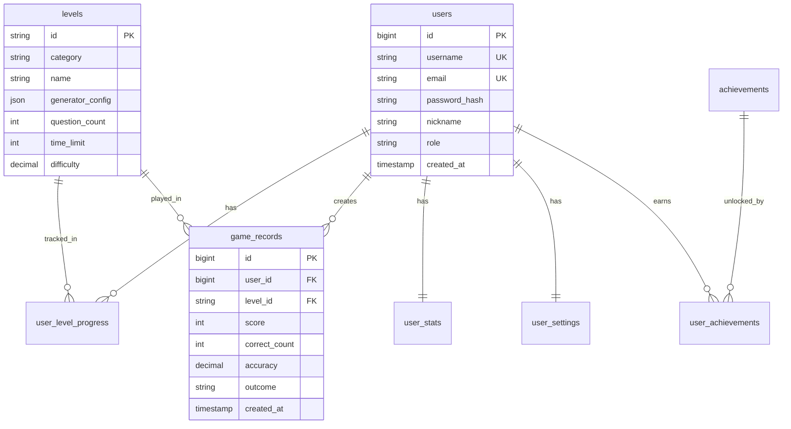

# 心算游戏项目总览

## 📚 文档导航

本项目包含以下核心文档：

1. **[后端开发规划](./后端开发规划.md)** - 后端技术架构、数据库设计、开发计划
2. **[API接口文档](./API接口文档.md)** - 完整的 API 接口规范
3. **[前端适配指南](./前端适配指南.md)** - 前端如何接入后端 API
4. **[设计文档](./设计文档.md)** - 原始游戏设计文档

---

## 🎯 项目愿景

将心算闯关游戏从纯前端应用升级为完整的前后端分离架构，支持：

- ✅ 多设备数据同步
- ✅ 全球排行榜系统
- ✅ 成就与任务系统
- ✅ 家长监控模式
- ✅ 数据统计分析
- ✅ 离线游玩支持

---

## 🏗️ 技术架构

```
┌─────────────────────────────────────────────┐
│              用户 (Web Browser)              │
└──────────────────┬──────────────────────────┘
                   │
         ┌─────────┴─────────┐
         │                   │
    ┌────▼────┐         ┌────▼────┐
    │  前端    │         │  后端    │
    │ React   │◄────────┤   Go     │
    │TypeScript│   API   │   Gin    │
    └─────────┘         └────┬─────┘
                             │
                   ┌─────────┴─────────┐
                   │                   │
              ┌────▼────┐         ┌────▼────┐
              │ MySQL   │         │  Redis  │
              │  5.7    │         │         │
              └─────────┘         └─────────┘
```

### 前端技术栈
- **框架**: React 18 + TypeScript
- **路由**: React Router v6
- **状态管理**: Context API
- **HTTP 客户端**: Axios
- **构建工具**: Vite

### 后端技术栈
- **语言**: Go 1.21+
- **Web 框架**: Gin
- **ORM**: GORM 2.0
- **数据库**: MySQL 5.7
- **缓存**: Redis
- **认证**: JWT

---

## 📊 数据库设计

### 核心表结构



**详细设计**: 见 [后端开发规划 - 数据库设计](./后端开发规划.md#3-数据库设计)

---

## 🔌 API 接口概览

### 认证模块
- `POST /api/v1/auth/register` - 用户注册
- `POST /api/v1/auth/login` - 用户登录
- `POST /api/v1/auth/refresh` - 刷新 Token
- `POST /api/v1/auth/logout` - 登出

### 用户模块
- `GET /api/v1/users/me` - 获取当前用户信息
- `PUT /api/v1/users/me` - 更新用户信息
- `GET /api/v1/users/me/settings` - 获取用户设置
- `PUT /api/v1/users/me/settings` - 更新用户设置

### 游戏模块
- `POST /api/v1/games/submit` - 提交游戏结果
- `GET /api/v1/games/records` - 获取游戏记录

### 统计模块
- `GET /api/v1/stats/me` - 获取用户统计
- `GET /api/v1/stats/me/progress` - 获取关卡进度

### 排行榜模块
- `GET /api/v1/leaderboard/global` - 全局排行榜
- `GET /api/v1/leaderboard/level/:levelId` - 关卡排行榜

**完整接口**: 见 [API接口文档](./API接口文档.md)

---

## 🗂️ 项目结构

```
MentalMathGame/
├── frontend/                  # 前端项目
│   ├── src/
│   │   ├── api/              # API 调用层
│   │   ├── components/       # 组件
│   │   ├── context/          # 状态管理
│   │   ├── hooks/            # 自定义钩子
│   │   ├── lib/              # 游戏逻辑
│   │   ├── routes/           # 页面路由
│   │   └── styles/           # 样式文件
│   └── package.json
│
├── backend/                   # 后端项目
│   ├── cmd/server/           # 入口
│   ├── internal/
│   │   ├── api/              # HTTP 处理
│   │   ├── model/            # 数据模型
│   │   ├── service/          # 业务逻辑
│   │   ├── repository/       # 数据访问
│   │   └── config/           # 配置管理
│   ├── migrations/           # 数据库迁移
│   ├── configs/              # 配置文件
│   └── go.mod
│
└── docs/                      # 项目文档
    ├── 后端开发规划.md
    ├── API接口文档.md
    ├── 前端适配指南.md
    └── 项目总览.md
```

---

## 🚀 开发计划

### 阶段一：基础架构（第 1-2 周）
- [x] 项目结构设计
- [x] 技术选型确认
- [x] 文档编写
- [ ] 数据库建表
- [ ] 后端项目初始化

### 阶段二：核心认证（第 3 周）
- [ ] 用户注册/登录 API
- [ ] JWT 认证中间件
- [ ] 前端认证系统集成

### 阶段三：游戏数据同步（第 4-5 周）
- [ ] 游戏结果提交 API
- [ ] 关卡进度查询 API
- [ ] 前端数据同步逻辑

### 阶段四：统计与排行榜（第 6 周）
- [ ] 统计 API
- [ ] 排行榜 API (Redis 缓存)
- [ ] 前端排行榜页面

### 阶段五：成就与任务（第 7 周）
- [ ] 成就系统
- [ ] 每日任务系统
- [ ] 前端成就页面

### 阶段六：高级功能（第 8 周）
- [ ] 家长模式
- [ ] 学习报告
- [ ] 数据导出

### 阶段七：优化与部署（第 9-10 周）
- [ ] 性能优化
- [ ] 单元测试
- [ ] 部署上线

**预计总工期**: 10 周（2-3 个月）

---

## 📝 核心设计决策

### 1. 游戏流程设计
**决策**: 前端生成题目，后端验证结果

**理由**:
- ✅ 保持现有前端逻辑不变
- ✅ 减少网络延迟，游戏体验流畅
- ✅ 降低后端压力
- ⚠️ 防作弊能力较弱（可通过异常检测缓解）

**替代方案**: 后端生成题目（用于重要赛事）

### 2. 认证方案
**决策**: JWT Token 认证

**理由**:
- ✅ 无状态，易于横向扩展
- ✅ 前后端分离友好
- ✅ 跨域支持良好
- ⚠️ Token 无法主动失效（可使用 Redis 黑名单）

### 3. 数据同步策略
**决策**: 游戏结束后异步提交，立即更新本地

**理由**:
- ✅ 用户体验好，无等待感
- ✅ 网络异常时不影响游戏
- ✅ 支持离线游玩
- ⚠️ 可能出现短暂数据不一致

### 4. 离线模式
**决策**: 支持离线游玩，登录后自动同步

**理由**:
- ✅ 用户无网络时也能玩
- ✅ 平滑过渡到在线模式
- ✅ 数据不丢失
- ⚠️ 需要处理数据冲突

---

## 🔐 安全考虑

### 1. 认证安全
- 密码使用 bcrypt 加密（cost=12）
- JWT Token 7 天有效期
- 登录失败 5 次锁定 15 分钟

### 2. API 安全
- 所有接口需要 Token 认证（除登录/注册）
- 请求限流：登录 5次/分钟，游戏提交 100次/小时
- 参数验证：使用 validator 库

### 3. 数据安全
- SQL 注入防护：GORM 参数化查询
- XSS 防护：React 自动转义 + API 数据清洗
- CSRF 防护：JWT 本身防 CSRF

### 4. 防作弊
- 基础合理性验证：分数/时间不能超过理论值
- 异常行为检测：连续高分、答题速度异常
- 重要赛事：后端生成题目

---

## 📈 性能优化

### 1. 数据库优化
- 合理索引：user_id、level_id、created_at
- 查询优化：避免 N+1 查询
- 连接池：最大连接数 100

### 2. 缓存策略
- 排行榜：Redis 缓存 5 分钟
- 用户信息：Redis 缓存 10 分钟
- 关卡配置：内存缓存

### 3. 前端优化
- 代码分割：路由懒加载
- 图片优化：WebP 格式 + CDN
- 请求合并：批量获取关卡进度

---

## 🧪 测试策略

### 1. 后端测试
- **单元测试**: Service 层业务逻辑（目标覆盖率 70%+）
- **集成测试**: API 接口测试
- **压力测试**: wrk 测试并发性能

### 2. 前端测试
- **单元测试**: 工具函数、钩子
- **组件测试**: React Testing Library
- **E2E 测试**: Playwright（关键流程）

### 3. 测试用例
- ✅ 用户注册/登录
- ✅ 游戏流程（开始-答题-结束-提交）
- ✅ 数据同步
- ✅ 排行榜更新
- ✅ 成就解锁

---

## 🚢 部署架构

### 开发环境
```
localhost:5173 (前端)
localhost:8080 (后端)
localhost:3306 (MySQL)
localhost:6379 (Redis)
```

### 生产环境
```
                  [Nginx]
                     |
        ┌────────────┴────────────┐
        |                         |
    [前端静态]                [后端 API]
    /var/www/frontend         Go 服务
                                  |
                     ┌────────────┴────────┐
                     |                     |
                 [MySQL]              [Redis]
               主从复制            缓存/排行榜
```

**详细配置**: 见 [后端开发规划 - 部署架构](./后端开发规划.md#9-部署架构)

---

## 📞 团队协作

### Git 工作流
- `main` - 生产环境分支
- `dev` - 开发分支
- `feature/xxx` - 功能分支
- `bugfix/xxx` - 修复分支

### Commit 规范
```
feat: 新增功能
fix: 修复 bug
docs: 文档更新
style: 代码格式调整
refactor: 重构
test: 测试
chore: 构建/工具配置
```

### Code Review
- 所有 PR 需要至少 1 人 Review
- 通过 CI 检查后才能合并

---

## 📚 参考资料

### 后端
- [Gin 官方文档](https://gin-gonic.com/)
- [GORM 官方文档](https://gorm.io/)
- [Go 项目布局](https://github.com/golang-standards/project-layout)

### 前端
- [React 官方文档](https://react.dev/)
- [Vite 官方文档](https://vitejs.dev/)
- [Axios 文档](https://axios-http.com/)

### 数据库
- [MySQL 5.7 文档](https://dev.mysql.com/doc/refman/5.7/en/)
- [Redis 文档](https://redis.io/documentation)

---

## ❓ FAQ

### Q1: 为什么选择 Go 而不是 Node.js？
A: Go 性能更好，部署简单（单个二进制文件），并发处理能力强，适合高并发场景。

### Q2: 为什么使用 MySQL 5.7 而不是 MySQL 8.0？
A: 考虑到部分云服务商仍使用 5.7，且 5.7 稳定性更好，功能已满足需求。

### Q3: 前端为什么不用 Next.js？
A: 本项目以游戏为主，不需要 SSR，使用 Vite + React 更轻量、开发体验更好。

### Q4: 如何处理数据迁移？
A: 用户登录后，检测 localStorage 数据，提示用户同步到服务器，详见[数据迁移方案](./后端开发规划.md#11-数据迁移方案)。

### Q5: 如何防止作弊？
A: 基础验证 + 异常检测，重要赛事改为后端生成题目，详见[安全考虑](./后端开发规划.md#12-安全考虑)。

---

## 📄 许可证

本项目仅供学习交流使用。

---

**文档版本**: v1.0  
**最后更新**: 2024-XX-XX  
**维护者**: 开发团队

